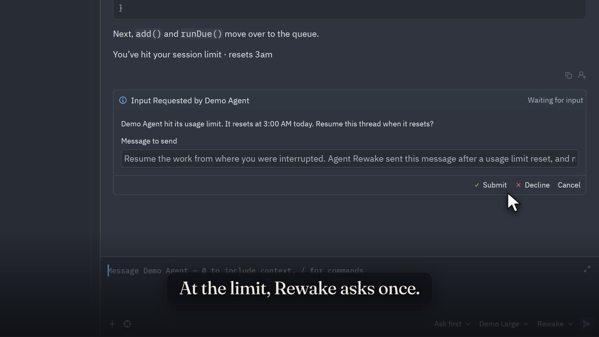
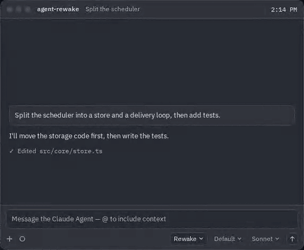
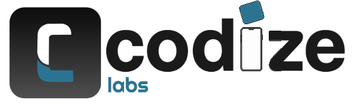

<div align="center">


# Agent Rewake

**Your Zed agent hits its usage limit. Rewake picks the thread back up the moment it resets.**

Works with Claude, Codex, Gemini CLI and every other external agent in [Zed](https://zed.dev), in the threads you already have.

[](https://www.npmjs.com/package/@codizelabs/agent-rewake)
[](LICENSE)
[](https://nodejs.org)
[](#requirements)

[Docs](https://codizelabs.github.io/agent-rewake/docs/) · [Website](https://codizelabs.github.io/agent-rewake/) · [Report a bug](https://github.com/codizelabs/agent-rewake/issues/new/choose)

<br>

[](https://codizelabs.github.io/agent-rewake/#film)

<sub>▶ <a href="https://codizelabs.github.io/agent-rewake/#film">Watch the 1-minute intro</a> (with narration and captions)</sub>

</div>

---

## The problem

Coding agents stop at their usage limit: Claude's 5-hour session limit, Codex's message limits, Gemini's daily quota. It always happens mid-task, and the limit often resets at 3 AM, when nobody is there to type "continue". The work just sits there.

## What Agent Rewake does



- **Resumes after a usage limit.** When the agent stops, the thread asks once whether to resume, with your resume message ready to edit. At the reset (plus a minute), Rewake sends it and the agent carries on. If the agent is still limited, Rewake waits for the new reset time.
- **Automatic, if you want.** Turn it on for a thread, or for every new thread, and Rewake schedules the resume without asking. It asks first when a limit resets more than a day away, never resumes credit or billing limits, and never approves permission prompts for you.
- **Queues the next steps.** Add follow-up messages that go one after another once the work resumes.
- **Also: send messages later.** Schedule a message into a thread for a time, or on a repeat (every weekday at 9, or any cron schedule, read back in plain words before it's saved). Your agent can propose follow-ups too; nothing is scheduled until you approve it.
- **One place for everything.** A **Rewake** menu under the message box, and a schedules page for every thread and agent.

No new agent to pick: Rewake sits in front of the agents you already use, under their own names, so your existing threads keep working.

## Is it for you?

Rewake works in **Zed's Agent Panel** (⌘? on macOS, Ctrl+? on Linux, Ctrl+Shift+/ on Windows), with an **external agent** such as Claude Agent, Codex or Gemini CLI. If that's where you chat with your agent, it's for you.

It can't reach:

- **Zed's own agent** (the panel's built-in one): Zed doesn't let add-ons into it. Start the thread with Claude Agent in the same panel instead.
- **Claude outside the Agent Panel**: the Claude desktop app, claude.ai, or Claude Code in a terminal (Zed's included). Claude Code and the desktop app each have their own setting to continue after a usage limit.

## Quick start

```sh
npx @codizelabs/agent-rewake install
```

`install` lists the agents it will add Rewake to and asks before changing anything. Each settings file is backed up first, and your comments and settings are kept.

Then **quit Zed completely and open it again** (⌘Q on macOS, Ctrl+Q on Linux; on Windows, close every Zed window), open the **Agent Panel**, and open or start a thread with one of your agents. Zed starts Rewake with that thread, not when Zed itself starts. A **Rewake** menu now sits under the message box, next to the model picker.

If you have no external agents yet, `install` offers to add **Claude Agent**: pick it in the Agent Panel and sign in with your Claude account.

Check the setup at any time. `doctor` looks at Zed, its settings and agents, Rewake, sign-in, your scheduled messages and recent problems, and says in plain words what's left to do. It works offline and prints no folders, accounts or keys:

```sh
npx @codizelabs/agent-rewake doctor
```

### Updating

From any version, the same two steps: run `npx @codizelabs/agent-rewake@latest install`, then quit Zed completely and open it again. Your threads, scheduled messages and settings stay. Details, and any version-specific steps (none so far), are in the [docs](https://codizelabs.github.io/agent-rewake/docs/#update).

### Requirements

- [Zed](https://zed.dev) 1.22 or newer, with its AI features on, and an external agent in the Agent Panel (for example Claude Agent, signed in). `install` can add Claude Agent for you
- [Node.js](https://nodejs.org) 22 or newer
- macOS, Linux (including Flatpak Zed) or Windows

## How it works

```text
Zed  ⇄  Agent Rewake  ⇄  your agent (Claude, Codex, Gemini…)
```

Zed talks to external agents over the [Agent Client Protocol](https://agentclientprotocol.com). Rewake is a thin layer on that connection: it passes everything through unchanged, adds its menu and forms to the thread, notices when the agent reports a usage limit, and sends your messages into the same thread at the right time. It runs on your machine, inside Zed's own agent process; nothing runs in the cloud.

## Use it

| To… | In the thread | Or type |
|---|---|---|
| Resume after a limit | **Rewake → Resume after the usage limit…** (offered automatically) | `/schedule resume` |
| Resume automatically | **Rewake → Turn on auto-resume after limits…** | `/schedule auto on` |
| Schedule a message | **Rewake → Schedule a message…** | `/schedule in 3h Run the tests` |
| Repeat a message | **Custom time…** in the schedule form | `/schedule every weekday 09:00 Check the build` |
| See or change messages | **Rewake → Schedules**, **Change a scheduled message…** | `/schedule list` |
| See every thread | The Zed task **Agent Rewake: schedules** | `npx @codizelabs/agent-rewake ui` |

Full guide: **[codizelabs.github.io/agent-rewake/docs](https://codizelabs.github.io/agent-rewake/docs/)**.

## Supported agents

Rewake works the same way in front of every external agent Zed runs: **Claude Agent, Codex, Gemini CLI, GitHub Copilot, OpenCode, goose** and the rest, npm-based or binary, plus custom agents. Claude and Codex report when their limit resets; for other agents Rewake recognises the limit from the error and lets you pick when to resume.

## Privacy

- Runs locally. Rewake makes no network calls of its own and never sees your credentials: sign-in goes through each agent's own flow.
- Sends only what you scheduled, approved, or turned on.
- Stores scheduled messages and per-thread settings in a private folder on your machine; logs hold metadata only, never message content.

## Uninstall

```sh
npx @codizelabs/agent-rewake uninstall
```

This puts every agent back the way it was. `doctor` shows the folder where Rewake keeps its data, if you want to delete that too.

## Status

Early release (0.1). Tested on macOS, Linux and Windows with Node.js 22 and 24. Feedback and bug reports are very welcome: [open an issue](https://github.com/codizelabs/agent-rewake/issues/new/choose).

## Contributing

Contributions are welcome. See [CONTRIBUTING.md](CONTRIBUTING.md) to get set up, and [SECURITY.md](SECURITY.md) to report a vulnerability privately.

## Support

Agent Rewake is free and open source. If it saves you time, you can [support it on Ko-fi](https://ko-fi.com/R5R31N7TP) ☕, or star the repository so others find it.

## License

[Apache-2.0](LICENSE) © KASHAN HAIDER · [Codize Labs](https://github.com/codizelabs)

<p align="center">
  <a href="https://github.com/codizelabs">
    <picture>
      <source media="(prefers-color-scheme: dark)" srcset="site/public/images/codizelabs-logo-reversed.png">
      
    </picture>
  </a>
</p>

<sub>Agent Rewake is an independent project, not affiliated with, endorsed by, or sponsored by Anthropic, OpenAI, Google or Zed Industries. Claude is a trademark of Anthropic, PBC. Zed is a trademark of Zed Industries, Inc.</sub>
